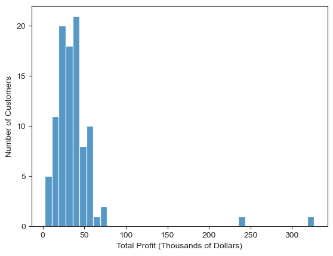
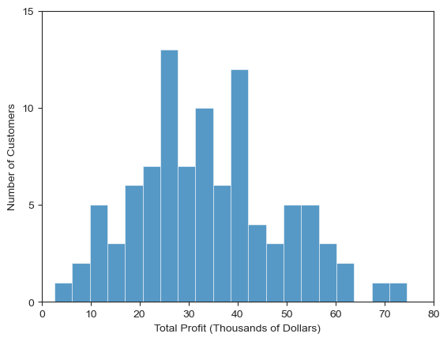

# Analyzing Model Vehicle Sales
Jack Kolberg-Edelbrock, PhD

## Executive Summary
Our client is a wholesaler that sells scale-model vehicles to businesses. Using both SQL and Python techniques, I investigated several aspects of the company's operations. Important findings include:
* 10 items are on backorder, all of which have over 150 units on backorder
* *Euro+ Shopping Channel* and *Mini Gifts Distributors Ltd.* are VIP customers
* Overall revenue appears to be increasing
* Holiday spending has been stagnant over the reported data
* No new customers have been acquired in the past 9 months

I used these findings to develop several recommendations for the company moving forward:
* Limit the amount of backordering permitted, to avoid excessive lack of product
* Host private celebratory/marketing events for the two VIP customers
* Increase marketing efforts around the holiday season - perhaps offer holiday discounts or holiday themed products
* Invest in acquiring new customers

## Introduction
In this SQL-based (SQLite) project, I investigate data provided by a wholesaler that purchases scale-model vehicles (motorcycles, airplanes, vehicles, and trains) from manufacturers and sells them to retailers.

### Company structure
Our client is an international wholesaler of scale-model vehicles that has offices in five countries across four continents. They have 23 employees organized into geographically defined sales groups:
- Europe, Middle East, and Africa (EMEA)
- North America (NA)
- Asia Pacific Region (APAC)
- Japan

With the exception of the Japanese group, each group has a sales manager and a team of sales reps. The Japanese team consists of two sales representatives.

The structure of the company is graphically depicted in *figure 1*.
##### Figure 1: Company employee heirarchy


With the information presented in the database, I infer that the company is a family-based business, due to the presence of three "Pattersons" and two "Firrellis".

### Market Structure and Outlook
There are about 20 major companies operating within this market, including *Mattel Inc.*, *Amalgam Collection*, *Hamleys of London Ltd.*, and *Welly Die Casting Factory Ltd.* Together, these companies and others represent a scale-model vehicle market [estimated at USD 4.2B in 2023 by Technavio](https://www.technavio.com/report/automotive-diecast-scale-model-market-industry-analysis). The consumer market is primarily in the US, EU, and Japan, and is expected to grow by about 6% each year through 2028.

## Exploring the Database
The database consists of 8 tables, as shown in *figure 2*. These tables are of varying size (*table 1*), with the largest table containing the order details (5 attributes, 2,996 rows) and the smallest table containing information about the product lines (4 attributes, 7 rows)
##### **Figure 2:** Database Schema


##### **Table 1:** Relative shapes of the individual tables
<table><tr><th>table_name</th><th>num_attributes</th><th>num_rows</th><tr><tr><td>customers</td><td>13</td><td>122</td></tr><tr><td>employees</td><td>8</td><td>23</td></tr><tr><td>offices</td><td>9</td><td>7</td></tr><tr><td>orderdetails</td><td>5</td><td>2996</td></tr><tr><td>orders</td><td>7</td><td>326</td></tr><tr><td>payments</td><td>4</td><td>273</td></tr><tr><td>productlines</td><td>4</td><td>7</td></tr><tr><td>products</td><td>9</td><td>23</td></tr></table>

### Individual Table Descriptions
Each table serves the general purpose described below:
- `customers` contains customer identifying information and links to the `employees`, `payments`, and `orders` tables
- `employees` contains employee identifying information. It contains self-references providing the company heirarchy, and references the `offices` table as well as the `customers` table
- `offices` contains office contact information and only links to the `employees` table
- `orderdetails` contains line item detail for each of the orders, including the specific item ordered, the quantity, the unit price, and the order line number. It links to the `products` and `orders` table
- `orders` contains timing-related and identifying information for each of the orders, and it provides a section for free-text comments. It links to the `orderdetails` and `customers` tables
- `payments` contains details on the checks, dates, and amounts of payments made by customers. It is only linked to the `customers` table
- `productlines` is a classifying table, which only contains 7 rows. It is only linked to the `products` table
- `products` contains all the information about individual items the company sells. This includes information necessary to calculate profit margins. There is extensive free-text in this table, some of which would be better split out into individual columns. It links to the `productlines` and `orderdetails` tables

## Data Analysis
### Identifying Low-Stock Items
One possible way to identify items that are at risk of running out of stock is to compare the quantity ordered (regardless of delivery status) with the quantity on-hand.
To accomplish this with the tables we are given, we need to bring the stock information (in the `products` table) together with the line-item information (in the `orderdetails` table). Since we are interested in the individual products, this information can be grouped by product.

The basic query we can use to accomplish this task is:
```
SELECT p.productcode,
       p.productName,
       quantityInStock AS num_stocked,
       SUM(quantityordered) AS num_ordered,
       ROUND((SUM(quantityordered) * 1.0) / quantityinstock, 2) AS stock_fraction,
       buyprice AS buy_price,
       priceeach AS sell_price,
       priceeach * SUM(quantityordered) AS revenue,
       (priceeach - buyprice) * SUM(quantityordered) AS profit,
       ROUND((priceeach - buyprice)/priceeach, 2) AS profit_margin
  FROM products AS p
 INNER JOIN orderdetails AS od
    ON p.productcode = od.productcode
 GROUP BY p.productcode
```
The stock fraction metric in the code block above was used to identify products that were overstocked while normalizing to the quantity of each product in stock

$$ \text{Stock Fraction} = \frac{n_{ordered}}{n_{stocked}}$$

Where $n_{ordered}$ is the number of items ordered and $n_{stocked}$ is the number of items in stock.

Using this base code, we can add different filters to find important information on the data. For example, if we order by `stock_fraction` ascending, it is clear that we are extremely overstocked in *1995 Honda Civics* and *2002 Chevy Corvettes*. These are items that we do not need to order anytime soon. Several other important observations follow.

#### Back-Orders
If we filter for stock_fractions greater than 1.0, we pull out all of the products that are on back order. The number of items on backorder can be added to the query by adding the following code to the `SELECT` statement:
```
CASE
    WHEN SUM(quantityordered) - quantityinstock <= 0
    THEN 0
    ELSE SUM(quantityordered) - quantityinstock
END AS num_backordered
```
There are 11 products currently on backorder (*table 2*):

##### **Table 2**: Products currently on backorder
| productName                                 | num_stocked | num_ordered | num_backordered |
| ------------------------------------------- | ----------- | ----------- | --------------- |
| 1960 BSA Gold Star DBD34                    | 15          | 1015        | 1000            |
| 1968 Ford Mustang                           | 68          | 933         | 865             |
| 1928 Ford Phaeton Deluxe                    | 136         | 972         | 836             |
| 1997 BMW F650 ST                            | 178         | 1014        | 836             |
| Pont Yacht                                  | 414         | 958         | 544             |
| F/A 18 Hornet 1/72                          | 551         | 1047        | 496             |
| 2002 Yamaha YZR M1                          | 600         | 992         | 392             |
| 1928 Mercedes-Benz SSK                      | 548         | 880         | 332             |
| 1911 Ford Town Car                          | 540         | 832         | 292             |
| The Mayflower                               | 737         | 898         | 161             |
| 1996 Peterbilt 379 Stake Bed with Outrigger | 814         | 988         | 174             |

With this information about backordered items, we can identify the following:
* Urgent restock tasks
* Items that are priced too low
* Items that should be kept in higher stock

#### High-margin, Low-stock Products
The most important items to keep in stock are those that are both in demand and highly profitable. These items can be identified by filtering for high stock_fraction and high profit_margin. Filtering with 0.6 and 0.5, respecively, we find two very profitable items that are out of stock (*table 3*).

##### Table 3: High-margin, low-stock products
| productName            | stock_fraction | profit_margin |
| ---------------------- | -------------- | ------------- |
| 1928 Mercedes-Benz SSK | 1.61           | 0.57          |
| 2002 Yamaha YZR M1     | 1.65           | 0.54          |

### Customer Segmentation
Marketing efforts are most effective when they are tailored to a subgroup of the overall customer base. In this case, I perform customer segmentation to identify VIP customers and unengaged customers. By separating these out, the company can plan marketing strategies to best reach each of these groups individually.

In evaluating the customer base and their relative contributions to revenue, I will connect customer and sales data together by joining the `products`, `orderdetails`, and `orders` tables. The basic query will take this form, with additional filters added to perform specific tasks:

```
SELECT o.customernumber,
       COUNT(*) AS num_orders,
       ROUND(SUM(od.quantityordered * od.priceeach), 2) AS total_revenue,
       ROUND(SUM(od.quantityordered * (od.priceeach - p.buyprice)), 2) AS total_profit
  FROM orders AS o
 INNER JOIN orderdetails AS od
    ON o.ordernumber = od.ordernumber
 INNER JOIN products AS p
    ON p.productcode = od.productcode
 GROUP BY o.customernumber
```

#### Identifying VIP Customers
Using the `total_revenue` and `total_profit` data, we can easily pull out VIP customers. The distribution of the calculated `total_profit` and `total_revenue` show that there is a clear cutoff for VIP customers (*figure 3*) at around \$100,000 of total profit. This exclusive group includes only two customers: 
* Euro+ Shopping Channel
* Mini Gifts Distributors Ltd.

##### Figure 3: Distribution of customers by total profit



#### Stratifying Remaining Customers
Removing the two upper outliers from the analysis, we can see additional details within the larger group of customers (*figure 4*). Specifically, I chose to separate the remaining customers into three groups:
* High buyers  ($50k - $100k)
* Middle buyers ($15k - $49k)
* Low buyers ($0k - $14k)

These stratification thresholds were chosen based on the visual structure of *figure 4* (a possible improvement to this technique would be to assign customer strata by percentile cutoffs)

##### Figure 4: VIP-free distribution of customers by total profit


With these groups in mind (VIP, high, middle, low), each of these groups can be addressed in different ways. The VIP's should be catered to individually, perhaps with special events. The low buyers can be targeted with promotions that encouraging bulk purchasing. The middle buyers can be receive typical promotions, while the high buyers should receive preferential attention from associates.
### Growth Evaluation
#### Revenue Growth
All of the orders placed have associated dates, so we can stratify the numbers by date and get an idea of the company's growth over the covered time period. In this case, monthly stratification was most effective, and that was accomplished by parsing the string dates (in YYYY-MM-DD) format using the following code which reformatted the string into a single integer:

```
CAST(SUBSTR(orderdate, 1, 4) AS INT) * 100 
+ CAST(SUBSTR(orderdate, 6, 2) AS INT) AS year_month
```

The data was then grouped by `year_month` and plotted to reveal year-on-year trends (*figure 5*). This reveals the following trends:
* Year-on-year revenue has generally increased
* November is the highest revenue month each year
* October and November year-on-year revenue appears unchanged

##### Figure 5: Revenue trends


The high revenue in October and November can likely be attributed to the holiday shopping season. Since there is not a year-on-year increase in holiday spending, this is an area that the company could use marketing techniques to improve.

#### Customer Growth
In addition to revenue growth, customer growth is another important metric for company growth. To do this, I created a table of customer numbers along with their year and month from the `orders` table. I took this table and processed it using Pandas to find the growth in unique customer numbers during the observed time (*figure 6*)

##### Figure 6: Customer growth trends


This plot shows that the company has not acquired any new customers in the last 9 months of recorded data. This represents both a significant problem and an opportunity to improve. The company should focus on expanding their customer base to increase revenues.

## Other Findings

#### Importance of Vehicle's Country of Origin
In the world of motor vehicles, different countries have different stereotypes. German cars are well-designed and high performance. Italian cars are luxurious. Japanese cars are reliable. To evaluate if there was any correlation between the country of origin of a car and the corresponding model's performance at the company. To perform this analysis, I first created a `view` that contained added researched information about the different car models. This view added information to the dataset about the vehicle's make and country of origin. The entire query can be found at `./code/views/view-make_country.sql`, and example code showing three makes and three countries of origin is shown below:
```
DROP VIEW IF EXISTS make_and_country;

CREATE VIEW make_and_country
AS
SELECT CASE
            WHEN productName LIKE '%Harley%' THEN 'Harley-Davidson'
            WHEN productName LIKE '%Renault%' THEN 'Renault'
            WHEN productName LIKE '%Guzzi%' THEN 'Moto Guzzi'
            ...
            ELSE NULL
       END as make,
       CASE
            WHEN productName LIKE '%Harley%' THEN 'United States'
            WHEN productName LIKE '%Renault%' THEN 'France'
            WHEN productName LIKE '%Guzzi%' THEN 'Italy'
            ...
            ELSE NULL
       END as origin,
       productcode,
       productname
  FROM products
```

Using this view as a basis for further analysis, I identified that the company carried mostly American vehicles (46 different models), Italian cars have the highest average quantity on hand, and French models have the largest profit margin. In addition to this, I identified that French car models have the highest profit margin, while models of United Kingdom vehicles have the smallest (*table a*).

$$\text{Profit Margin} = \frac{\text{Sell Price - Buy Price}}{\text{Buy Price}}$$

##### Table a: Stock and profit-margin information by Country of origin
|origin        |num_models|avg_quantity_on_hand|profit_margin|
|--------------|----------|--------------------|-------------|
|Italy         |11        |6365                |0.67         |
|Japan         |6         |6056                |0.62         |
|United Kingdom|3         |5645                |0.56         |
|France        |3         |5584                |0.73         |
|United States |46        |5024                |0.68         |
|Germany       |13        |4962                |0.64         |

#### Slow-moving Products
If we instead sort the table by low `stock_fractions`, we find many products where less than 10% of our inventory has been sold (*table b*):

##### Table b: Slow-moving products
| productName                    | num_stocked | num_ordered |
| ------------------------------ | ----------- | ----------- |
| 1995 Honda Civic               | 9772        | 917         |
| 2002 Chevy Corvette            | 9446        | 894         |
| 2002 Suzuki XREO               | 9997        | 1028        |
| 1968 Dodge Charger             | 9123        | 925         |
| 1965 Aston Martin DB5          | 9042        | 914         |
| 1932 Model A Ford J-Coupe      | 9354        | 957         |
| 1999 Indy 500 Monte Carlo SS   | 8164        | 855         |
| 1976 Ford Gran Torino          | 9127        | 915         |
| 1982 Ducati 996 R              | 9241        | 906         |
| America West Airlines B757-200 | 9653        | 984         |